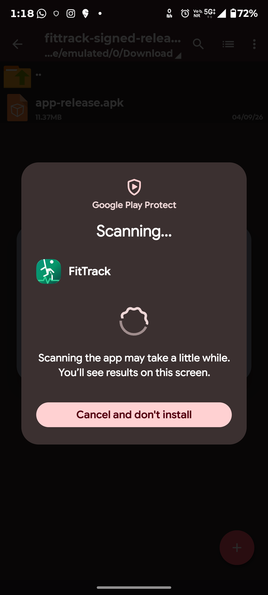
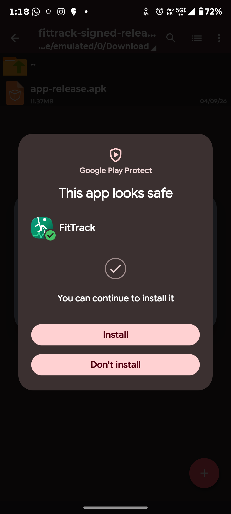

# FitTrack — Fitness Tracking App

> A modern, offline-first native Android fitness tracking application for recording workouts, monitoring daily steps, tracking calories and workout duration, and viewing weekly fitness progress.

[](https://developer.android.com/)
[](https://kotlinlang.org/)
[](https://developer.android.com/compose)
[](https://m3.material.io/)
[](https://developer.android.com/training/data-storage/room)

## 📱 Overview

**FitTrack** is a native Android fitness tracking app designed around a simple principle: make everyday fitness logging quick, clear, and completely offline.

The application lets users manually record workouts and daily steps, review their activity history, monitor calories and workout duration, and understand weekly progress through visual analytics. All personal fitness data is stored locally on the device using Room Database and DataStore Preferences.

## ✨ Features

### 🏠 Fitness Dashboard

- Daily steps overview with progress toward a configurable goal.
- Daily calories burned summary.
- Total workout duration and workout count.
- Quick access to today's activities.
- Animated circular step-progress indicator.

### 🏋️ Workout Logging

- Log common activities including:
  - Walking
  - Running
  - Cycling
  - Swimming
  - Gym
  - Strength Training
  - Yoga
  - Cardio
  - And other activities
- Record workout duration in minutes.
- Automatic calorie-burn estimation based on the selected activity and duration.
- Select a custom workout date.
- Add optional workout notes.
- Input validation for reliable records.

### 📋 Workout History

- View previously recorded workouts chronologically.
- See workout type, duration, date/time, and calories.
- Filter history by exercise type.
- Edit existing workout records.
- Delete workouts with confirmation.

### 📊 Weekly Statistics & Analytics

- Seven-day fitness overview.
- Weekly totals for:
  - Steps
  - Calories burned
  - Workout duration
  - Number of workouts
- Visual weekly charts for calories, duration, and steps.
- Day-by-day activity breakdown.
- Canvas-based chart rendering with animated presentation.

### ⚙️ Settings & Data Privacy

- Configure a personal daily step goal.
- Quick step-goal presets such as 6,000, 8,000, 10,000, and 12,000 steps.
- Optional demo-data generation for testing the analytics screens.
- Reset locally stored fitness data.
- No account or cloud backend required.
- Designed to work without an internet connection.

## 🛠️ Technology Stack

| Category | Technology |
|---|---|
| Language | Kotlin |
| UI | Jetpack Compose |
| Design | Material 3 |
| Architecture | MVVM + Repository Pattern |
| State Management | Coroutines + Flow / StateFlow |
| Local Database | Room Database / SQLite |
| Preferences | Jetpack DataStore |
| Navigation | Navigation Compose |
| Build System | Gradle + Android Gradle Plugin |
| Code Generation | Kotlin Symbol Processing (KSP) |

## 🏗️ Architecture

FitTrack follows a modern Android architecture to keep the application maintainable and scalable.

```text
┌──────────────────────────────┐
│        Jetpack Compose       │
│       UI / Screens            │
└──────────────┬───────────────┘
               │
               ▼
┌──────────────────────────────┐
│          ViewModels          │
│     UI State + Business      │
│          Logic               │
└──────────────┬───────────────┘
               │
               ▼
┌──────────────────────────────┐
│         Repository           │
│   Data Access Abstraction    │
└──────────────┬───────────────┘
               │
        ┌──────┴───────┐
        ▼              ▼
┌──────────────┐ ┌──────────────┐
│ Room Database│ │  DataStore   │
│   / SQLite   │ │ Preferences  │
└──────────────┘ └──────────────┘
```

## 📂 Project Structure

```text
FitTrack-Fitness-Tracking-App/
├── .github/
│   └── workflows/
│       └── build-apk.yml
├── app/
│   └── src/
│       ├── main/
│       │   ├── java/.../
│       │   └── res/
│       └── test/
├── gradle/
│   └── libs.versions.toml
├── build.gradle.kts
├── gradle.properties
├── settings.gradle.kts
├── metadata.json
└── README.md
```

## 🚀 Build the Project

### Requirements

- Android Studio with a compatible Android SDK.
- JDK 17.
- Gradle 9.3.1 for the current project configuration.

### Build Debug APK

For local development/testing, if the Gradle wrapper is available:

```bash
./gradlew assembleDebug
```

The generated debug APK is located at:

```text
app/build/outputs/apk/debug/app-debug.apk
```

### Build Release APK

The repository's CI workflow builds a **signed Release APK** for installation testing and submission:

```bash
./gradlew assembleRelease
```

The generated release APK is normally located at:

```text
app/build/outputs/apk/release/app-release.apk
```

## 🤖 GitHub Actions APK Build

The repository includes a GitHub Actions workflow at `.github/workflows/build-apk.yml`.

The current workflow:

1. Checks out the repository.
2. Configures JDK 17.
3. Installs Gradle 9.3.1.
4. Generates a CI release signing key for the build.
5. Builds the Android application with `assembleRelease`.
6. Verifies the APK signature.
7. Uploads the signed Release APK as a workflow artifact.

This provides a reproducible CI build and a downloadable signed Release APK without requiring a local computer for the build.

> **Signing note:** The CI workflow currently generates an ephemeral signing key for each CI build. For a production app with future updates, a stable developer signing key should be securely retained and reused.

## 🛡️ Google Play Protect Verification

The CI-generated **signed Release APK** was manually tested by installing it from outside Google Play on a physical Android device with Google Play Protect enabled.

### Observed Play Protect Result

During the documented test, Google Play Protect displayed:

> **"This app looks safe"**
>
> **"You can continue to install it"**

The installation was allowed to continue after the Play Protect check.

| Verification | Result |
|---|---|
| Signed Release APK generated by GitHub Actions | ✅ Passed |
| APK signature verification in CI | ✅ Passed |
| Play Protect installation check | ✅ App looked safe on the tested device |
| Installation allowed | ✅ Yes on the tested device |
| Manual installation test | ✅ Passed |

**Verification status:** ✅ The tested Release APK was accepted for installation by Play Protect on the test device.

> **Important device-compatibility note:** This is a documented, point-in-time result for the tested APK and device. Google Play Protect is a dynamic security system, and the exact scan screen, warning, or safe-to-install message may not appear on every device or installation. Results and displayed messages can vary depending on the device, Android version, Google Play services, account/device state, APK version, installation history, and Google's current security systems. This project does **not** claim universal Play Protect approval or certification, and it does not guarantee that every device or future build will display the same result.

Keep Google Play Protect enabled when installing APKs from outside Google Play.

For Google's description of Play Protect scanning and its handling of apps installed outside Google Play, see the [official Google Play Protect help](https://support.google.com/googleplay/answer/2812853).

## 📸 Play Protect Evidence

The following screenshots are the actual Play Protect evidence uploaded to this repository. They document the installation check and the resulting safe-to-install message observed on the test device.

### Play Protect Scanning



### Play Protect — App Looks Safe



## 🔒 Privacy & Offline Design

FitTrack is designed as an **offline-first** application.

- Fitness records are stored locally on the device.
- No cloud account is required.
- No third-party backend is required.
- The core tracking functionality does not depend on an internet connection.
- Users can manage and reset their locally stored data from Settings.

> **Note:** Calorie values are estimates intended for general fitness tracking and should not be treated as medical measurements.

## 🎯 Project Goals

- Demonstrate modern native Android development with Kotlin.
- Apply Jetpack Compose and Material 3 to a complete multi-screen application.
- Demonstrate MVVM and repository-based architecture.
- Implement persistent offline storage with Room and DataStore.
- Provide useful fitness analytics through visual data presentation.
- Automate Android APK builds with GitHub Actions.

## 🧪 Testing

The project is structured to support Android unit and Robolectric testing.

```bash
./gradlew testDebugUnitTest
```

## 📸 Screenshots

Application screenshots can be added to the `screenshots/` directory as the project evolves.

## 📦 APK

The recommended CI artifact for installation testing and CodeAlpha submission is the **signed Release APK** from the successful GitHub Actions workflow run. Download the Release APK artifact from the workflow's **Artifacts** section.

The older `assembleDebug` build remains useful for development, but it is not the recommended submission build.

## 🎯 CodeAlpha / Portfolio Verification

This repository documents both the automated CI build and the manual Play Protect installation test so reviewers can inspect the build process and the observed installation-security result.

## 👨‍💻 Author

**Sabareesh**

GitHub: [@saba1207B](https://github.com/saba1207B)

## 📄 License

This project is currently provided for educational and portfolio purposes.

---

⭐ If you find this project useful, consider starring the repository.
